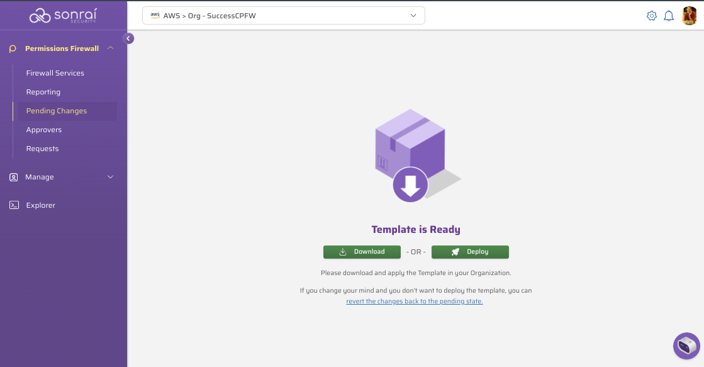
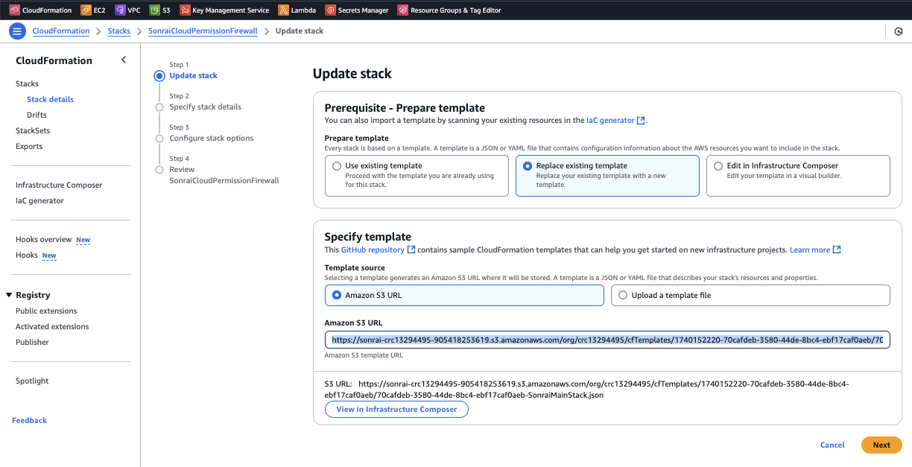
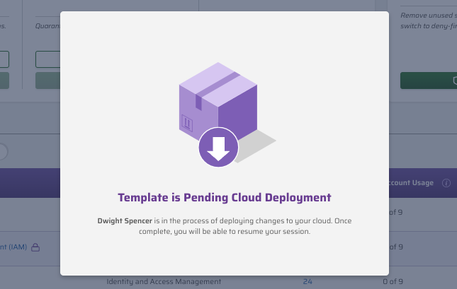

## Manage Cloud Permissions Firewall (CPF) Deployments with Terraform

Sonrai's firewall deploys using two CloudFormation stacks:
- Collector Identities
- Firewall Controls

The Collector Identities cannot be managed with a Terraform, but the
firewall control stacks can. In effect, a CloudFormation Stack is 
still in use, but they can be deployed and updated using Terraform. 

When deploying the firewall StackSet, the Terraform templates reference
the S3 object generated by the firewall in your AWS environment. That template file
contains the pending firewall control changes to deploy to your cloud.

The process to use & manage these CloudFormation templates with Terraform is as follows:  
- Complete control changes in the firewall UI
- Open "Pending Changes" and "Submit all (N) changes" to generate the template to deploy within your cloud
- Select "Deploy" to launch into the AWS CloudFormation dashboard 

- In AWS CloudFormation, locate & copy the S3 URL, for example   
  https://sonrai-crc13294495-90541772619.s3.amazonaws.com/org/crc13294495/cfTemplates/1740798220-70cafdebeb/70cafebf17caf0aeb-SonraiMainStack.json  
  
    
- Use this URL in your Terraform deploy process   
_Note, while the "Deploy" process is active, other users will be
blocked from making any changes in the firewall UI_  

- Once your Terraform deploy is complete, the firewall will complete a few additional steps to finalize the changes. 

---

## Template Files

#### [resource.tf](files/resource.tf)
- Template used for deploying changes in CPF 
- Enter the S3 URL in the `template_url` field 
- No other changes are required 

#### [output.tf](files/output.tf)
- Details what will be displayed once Terraform is complete
- Current template displays your firewall `OrgID`
- Add any other details, as needed

#### [provider.tf](files/provider.tf)
- Terraform "library" we are using
- Current requirements are:
  - HashiCorp
  - the AWS region where it is queried 
_Note, this does not have to be the same region(s) used for deploying the firewall_

#### [variables.tf](files/variables.tf)
- Variables are stored so multiple `resource.tf` files can use them
- Region(s) you are deploying the firewall changes in (update the value to your desired region)
 
