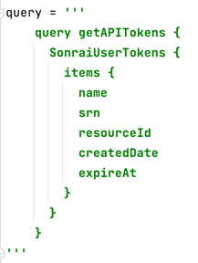

# Sonrai API V2 Python Client

Python client library and sample scripts to leverage the Sonrai GraphQL API.  

## Introduction

This library (sonrai_api) provides users with the ability to query the Sonrai GraphQL API, using a variety of methods:

  * Execute a saved UI search
  * Parse and execute a GraphQL query file
  * Execute a raw GraphQL query passed via command line
  * Build logic to leverage the output of one query in another query

For more information on the GraphQL query format, open the [Advanced Search page](https://app.sonraisecurity.com/App/GraphExplorer) in the Sonrai UI and view the documentation.

## Prerequisites
#### requirements.txt

This script requires **Python 3**, as well as the *requests* and *pyjwt* libraries.  The libraries can be installed using one of these two methods:  

  * Using requirements file: `pip3 install -r requirements.txt`    
  * Manually: `pip3 install requests pyjwt`  

### Config Variables
#### config.json

| Variable                     | Description                                               | Default     |
|------------------------------|-----------------------------------------------------------|-------------|
| sonrai-api-log-level         | Log level for the api.py file                             | INFO        |
| sonrai-token-log-level       | Log level for the token.py file                           | DEBUG       |
| token_store                  | Directory of the token file                               | /tmp/sonrai |
| token_file                   | Name of the token file                                    | token       |
| token_length_secs            | Length of time token is valid (MAX 7200)                  | 7200        |
| token_refresh_threshold_secs | Minimum time of token life before auto renewal            | 1800        |
| proxy_server                 | http(s) value of proxy server                             | null        |
| verify_ssl                   | should all communication be verified SSL                  | 1           |
| query_timeout                | Maximum amount of time the query will wait before failing | 120         |
| query_retries                | Maximum amount of retries of a query before failing       | 10          |

All of these variables are available to your script using the **config[]** global dictionary

## Usage
#### api.py
This Python library can be imported into other scripts.

```from sonrai_api import api```

```api.execute_query(query)```

Where **query** would be an actual GraphQL query to the API, for example:



#### token.py
This file is used for internal purposes, you should not have to call on any functions within this file

#### example.py
A quick example showing how to import the api method and execute a query

### Warnings
Please **DO NOT** put your files / folder in the sonrai folder. Store your single script file or folder at the same hierarchical level as the sonrai folder.
```
|
|-scripts
|--sonrai_api(d)
|--your_script.py

or

|
|--sonrai_api(d)
|--your_script.py
```

### Exit(Error)
#### 255 - Unable to parse the config.json file
* There is a problem with the structure of the JSON in the config.json file, Please verify you are using proper JSON structure.

#### 254 - Unable to find the config.json file
* There is a problem locating the config.json file, Please make sure the file is located in the sonrai folder

#### 240 - Do not run your scripts in the same directory as the API Library
* You are attempting to run your python script in the same directory as the API main scripts, please see the Warnings sections above to remediate this issue.
